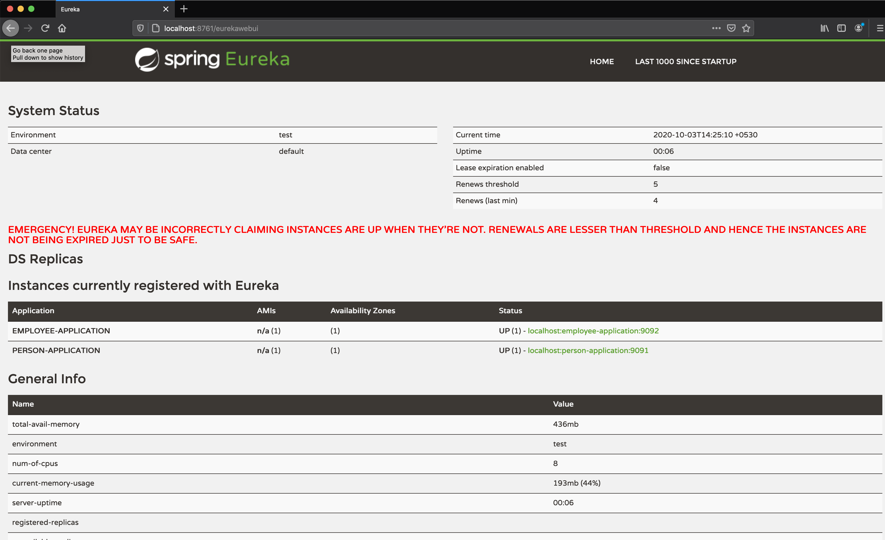
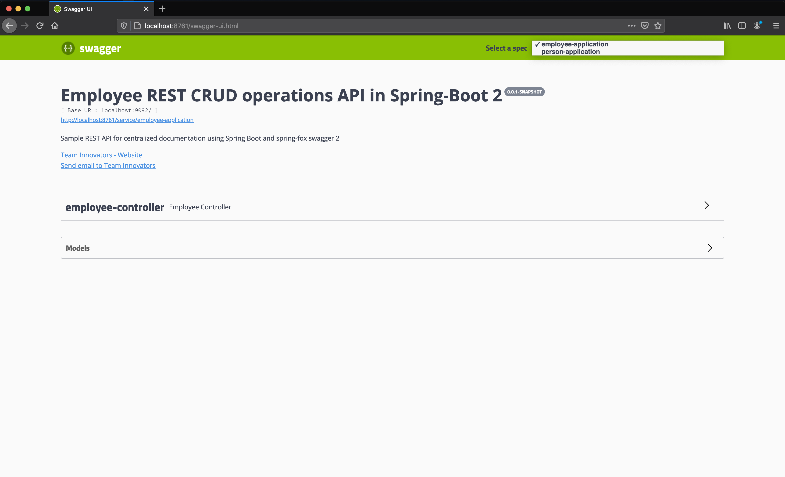
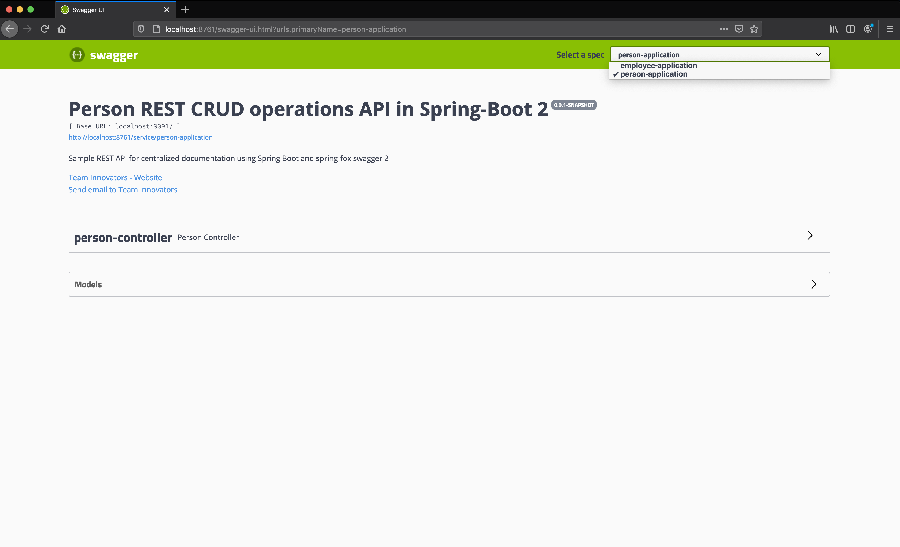

= centralised-api-documentation

The goal of this project is to implement a centralised documentation service using swagger, where API documentation for each microservice is available on single dashboard and user don't have to navigate to different urls.

== Technologies used

* `Swagger` to generate API documentation.
* `Spring Boot` for creating API
* `Gradle` build tool.
* `Eureka` as service registration and discovery

== Applications

* *documentation-app*
+
`Spring Boot` Web Java application that provides swagger dashboard with drop down menu.
From this menu documentation for each microservice can be fetched instantly.

* *employee-application*
+
`Spring Boot` Web Java application that provides rest endpoints to add person data and fetch person data.

* *employee-application*
+
`Spring Boot` Web Java application that provides rest endpoints to add employee data and fetch employee data.

== Configuration and shared components

* *eureka-swagger-client-config*
+
`Spring Boot` module that provides common configurations for CORS and EUREKA for each microservice.

== Running Applications with Gradle

Inside `centralised-api-documentation` root folder, run the following `Gradle` commands in different terminals

* *documentation-app*
+
[source]
----
./gradlew :documentation-app:bootRun
----

* *employee-application*
+
[source]
----
./gradlew :employee-application:bootRun
----

* *person-application*
+
[source]
----
./gradlew :person-application:bootRun
----

== Applications URLs

|===
|Application |URL

|documentation-app
|Swagger:- http://localhost:8761/swagger-ui.html || EurekaUI:-  http://localhost:8761/eurekawebui

|employee-application
|http://localhost:9092/swagger-ui.html

|person-application
|http://localhost:9091/swagger-ui.html

|===

== Images

* *Eureka Web UI*

* *employee-application swagger dashboard*

* *person-application swagger dashboard*

|===